```{r, include = FALSE}
knitr::opts_chunk$set(
  collapse = TRUE,
  comment = "#>"
)
```
<style>
  body {
    text-align: justify;
  }
  
  .col2 {
    columns: 2 200px;         /* number of columns and width in pixels */
    -webkit-columns: 2 200px; /* chrome, safari */
    -moz-columns: 2 200px;    /* firefox */
  }
  
  .leg {
    font-size: 12px;
  }

  img {
    display: block;
    margin-left: auto;
    margin-right: auto;
    max-width: 100%;
    height: auto;
  }

  .figure {
    text-align: center;
    margin: 20px 0;
  }

  .figure img {
    display: inline-block;
    vertical-align: middle;
  }

  .figure figcaption {
    font-size: 12px;
    text-align: center;
  }
</style>
* [Getting started](#getting-started)
  + [Setting-up user credentials](#setting-up-user-credentials)
  + [Setting-up Python](#setting-up-python)
* [Vegetation data](#vegetation-data)
  + [Land cover](#land-cover)
  + [Vegetation height](#vegetation-height)
  + [Leaf Area Index](#leaf-area-index)
* [Soil and elevation data](#soil-and-elevation-data) 
  + [Digital elevation data](#digital-elevation-data)
  + [Soil data](#soil-data)
* [Albedo data](#albedo-data)
* [Climate data](#climate-data)
  + [NOAA-NCEP Data](#noaa-ncep-data)
  + [ERA5 Data](#era5-data)
  + [UK Met Office data](#uk-met-office-data)
  + [UKCP18 Future Climate data](#ukcp18-future-climate-data)
  + [Sea-surface temperature data](#sea-surface-temperature-data)
* [Deriving model inputs](#deriving-model-inputs) 
  + [Deriving leaf and ground reflectance](#deriving-leaf-and-ground-reflectance)
  + [Vegetation parameters](#vegetation-parameters)
  + [Soil parameters](#soil-parameters)
  + [Climate inputs](#climate-inputs)

## Getting started
The purpose of this package is to enable download and processing of the vegetation, soil, terrain and climate data needed to drive a series of meso- and microclimate models developed by the same author of this package, namely `micropoint` and `microgrid`,the latter of which comprises `microclimf` and `mesoclim`. These other packages 
are also written using the R programming environment and available from author's Github site [here](https://github.com/ilyamaclean/). First, instructions are given for downloading data. Second, instructions are given for reformatting these data for use with these packages.

### Setting-up user credentials
This package interfaces with a number of geospatial data repositories. While data are free, you will need to register to download the data and provide your user credentials to the functions. For simplicity, all functions requiring user credential take as an input a single data.frame in which all credentials are stored. This should be saved on a secure location on your local drive. The inbuilt dataset `credentials` provides a template to which your own usernames and passwords should be added. It also contains weblinks for registering to use the services.

```{r eval=FALSE}
library(microclimdata)
data(credentials)
credentials
```

five sets of credentials are needed:

(1) Access to the Earthdata site for downloading 500m grid resolution MODIS-derived Leaf Area Index value data.

(2) Access to the WeKEO site for downloading 10m grid resolution Sentinel-derived Leaf Area Index value data.

(3) Access to the Centre for Environmental Data Analysis for obtaining future climate data globally or for one km grid reoslution historic data for the UK. 

(4) Access to the European Centre for Medium-Range Weather Forecasts (ECMWF) climate data store (CDS). Note that in July 2024 the CDS migrated to a new platform, and the old platform was deprecated in Sept 2024. The following describes how to add your credentials:

(i) Register for an ECMWF account [here](https://accounts.ecmwf.int/auth/realms/ecmwf/login-actions/registration?client_id=cds&tab_id=IA1LKqgLVc0). Upon registering you will need to accept all of the Terms and Conditions listed at the bottom of the form.

(ii) Then, navigate to the CDS site [here](https://cds-beta.climate.copernicus.eu/) and login using the button in the top right. Once logged in, hover your mouse over your name in the top right, and click on the option "Your profile" that appears (this should bring you to [this page](https://cds-beta.climate.copernicus.eu/profile). Here you will 
find the email address used to access the site and and Personal Access Token, both which are required for you to remotely download data from the CDS. Copy these into your credentials file - the email address goes under username and the personal access token in place of password.

(iii) Each CDS dataset has its own unique Terms of Use. You will need to accept these Terms for ERA5-reanalysis at [this page](https://cds-beta.climate.copernicus.eu/datasets/reanalysis-era5-single-levels?tab=download) (scroll down to "Terms of use" and accept). This same set of terms also applies for other Copernicus products, including ERA5-land.

(5) Access to the Centre for Environmental Data Analysis (CEDA) for downloading daily 1km HadUK-Grid historic climate data for the United Kingdom or UKCP18 Historic and Future climate data (global coverage). To access UKCP18 data, after registering, you will also need to obtain a CEDA access token from [this page](https://services-beta.ceda.ac.uk/account/token/?_ga=2.221117848.1874942177.1727205775-405001952.1710779653)

If you don't require one or other of these datasets, you can just leave the relevant entries in the data.frame as their default `myusername` and `mypassword`. 

### Setting-up Python
API access to some datasets is enabled by the `reticulate` package which interfaces with Python. So you will need to have Python installed on your computer if you want to download the vegetation data. To do this:

(1) Download the Python installer from [here](https://www.python.org/downloads/)

(2) Run the Installer and Choose "Customize Installation".

(3) Set the directory to something simple like `C:\Python\` as opposed to the default as R will struggle to interface if it is installed with long file paths.

(4) You will also need to install the `hda` and `earthengine-api` packages for Python. To do this type the following into the terminal in e.g. R studio (not the Console). Modify the base of the file path to match the directory to which Python is installed. 

In the terminal (not the Console in R Studio) type 

```
C:\Python\Scripts\pip.exe install hda -U 
```

```
C:\Python\Scripts\pip.exe install earthengine-api -U 
```

Prior to doing that you might be prompted to update `pip` (the Python package installer) to the latest version:

```
python -m pip install --upgrade pip
```

## Vegetation data
Three sets of vegetation data are used to create inputs for running microclimate models:
(1) land cover data, (2) vegetation height data and (3) Leaf Area Index values.
Download and procesing of these datasets is now described.

### Land cover
Land cover data are downloaded from Google Earth Engine into a specified folder 
on your GoogleDrive. You will therefore need a Google account - see [here](https://www.google.co.uk/intl/en-GB/drive/). Two types of data can be downloaded.
Either 100m grid resolution CORINE landcover data - see [here](https://land.copernicus.eu/en/products/corine-land-cover), which are available from 1986 to 2018 or more recent (2023) 10 m grid resolution land cover data from European Space Agency. The latter contains fewer habitat classes.

If running for the first time, or haven't downloaded data for a while, the first thing you will need to do is authorize access to Earth Engine. To do this, in R, run the following code 

```{r eval=FALSE}
library(rgee)
ee_Authenticate()
```
This should result in an R prompt to enter verification code and should open up a window in your internet browser, which have a series of prompts will eventually give you the option to copy and paste an authentication token. Copy the text and then paste into your R console. During the prompt process you will also be asked to set-up or link to a specific project (e.g. something like 'ee-yourname). Make a note of this as the name of this project should be specified in the function input `projectname`. Next create a folder on your GoogleDrive to which you want the data downloaded. Make a note of this as the folder should be specified in the function input `GoogleDrivefolder`.

You should now be good to start downloading he data. Below is an example of how to do this for CoRINE landcover data, linking to a project called `ee-imdmaclean` and downloading data to a folder called `GEE_Exports`. The area set for download is the Lizard Peninsula in Cornwall, UK.

```{r eval=FALSE}
library(terra)
# Create a template raster used to define the area of download
e <- ext(160000, 181400, 11300, 30000)
r <- rast(e)
crs(r) <- "EPSG:27700"
GoogleDrivefolder<-"GEE_Exports"
pathtopython<-"C:/Python/"
projectname<-'ee-imdmaclean'
lcover_download(r, type = "CORINE", year = 2018, GoogleDrivefolder, pathtopython, projectname)
```

Periodically the function will poll the task checking whether download is complete. After 20 seconds or so (depending on your internet speed), the task status should change to complete and a file called `CORINE_LandCover_2018.tif` should be in the relevant folder of your Google Drive. Google as some pretty hardcore firewalls set up that make it difficult to automatically transfer data from a GoogleDrive folder into R.
It is much easier just to download it manually and copy it into a a local folder and just read it in using something like

```{r eval=FALSE}
lcover <- rast("C:/Temp/CORINE_LandCover_2018.tif")
plot(lcover, col=rev(map.pal("viridis", 100)))
```
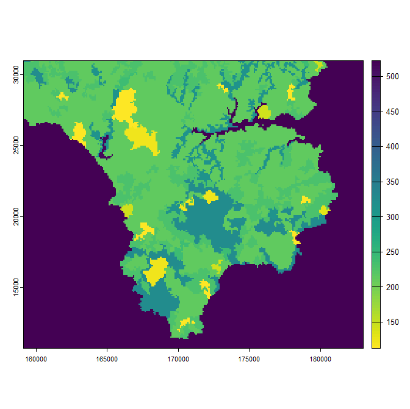\

Full details of the numbering system used to define the CORINE land cover classes are given
[here](https://collections.sentinel-hub.com/corine-land-cover/readme.html).

A very similar approach can be used to download and read in land cover data from ESA.
The data will take a little longer to download as the file is larger.

```{r eval=FALSE}
library(terra)
# Create a template raster used to define the area of download
lcover_download(r, type = "ESA", year = NA, GoogleDrivefolder, pathtopython, projectname)
# **** Copy data across to a local drive once complete ***
lcover <- rast("C:/Temp/ESA_WorldCover_2023.tif")
plot(lcover)
```
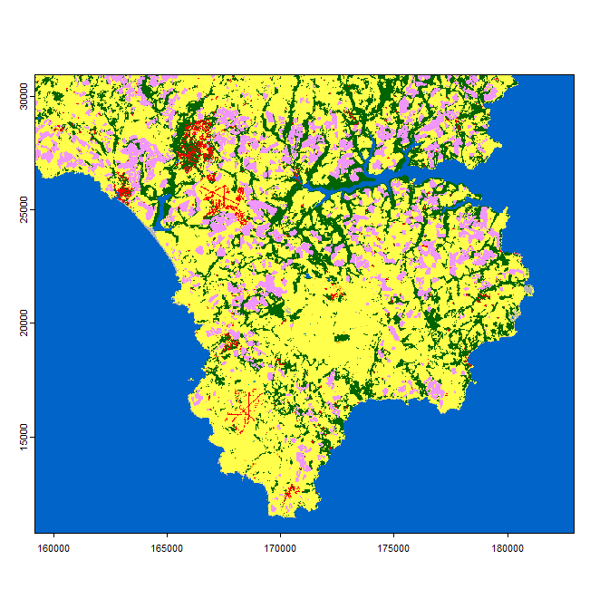\

Details of the numbering system and colour scheme used to define land cover types in the
ESA dataset are given [here](https://developers.google.com/earth-engine/datasets/catalog/ESA_WorldCover_v100#bands)

### Vegetation height
Vegetation height data are downloaded from Google Earth Engine in much the same way as land cover data and if you haven't already done so you will need to authorize access to Earth Engine using `ee_Authenticate()` as described above. The vegetation height dataset downloaded is the 10m grid resolution Global Canopy Height 2020 dataset produced by the EcoVision Lab described [here](https://nlang.users.earthengine.app/view/global-canopy-height-2020).

Below is some example code for downloading canopy height data, again for the Lizard Peninsula in Cornwall.

```{r eval=FALSE}
library(rgee)
library(terra)
e <- ext(160000, 181400, 11300, 30000)
r <- rast(e)
crs(r) <- "EPSG:27700"
GoogleDrivefolder<-"GEE_Exports"
pathtopython<-"C:/Python/"
projectname<-'ee-imdmaclean'
vegheight_download(r, GoogleDrivefolder, pathtopython, projectname)
```

Again the data can be copied across to a local drive manually, read into R and plotted. Vegetation height is in meters.

```{r eval=FALSE}
vhgt <- rast("C:/Temp/canopy_height_2020.tif")
plot(vhgt)
```
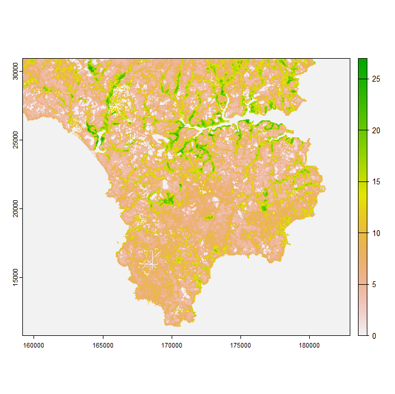\

### Leaf Area Index
There or two options for downloading Leaf Area Index (LAI) data. Firstly 10m resolution data from the Copernicus WEkEO site. These data are only available from 2019 to present and only for fairly limited parts of Europe (see [this site](https://www.wekeo.eu/data?view=dataset&dataset=EO%3AEEA%3ADAT%3ACLMS_HRVPP_VI) for details of coverage) though it is likely that with time, coverage will improve. Alternatively 500 m grid resolution LAI data derived from MODIS imagery can be downloaded  from LPDAAC_ECS using the `luna` package. Data are available globally from 18th February 2018 onward.In both cases, multiple files, corresponding to each satellite pass are downloaded and stored in the directory given by `pathout`. The files can the later be tiled together using `lai_mosaic` and filled using `lai_fill` to circumvent issues caused by cloud cover. `lai_downscale` can be used to `sharpen` the coarser resolution `500 m` LAI data using land cover and vegetation height datasets. Alternatively, if one has aerial imagery to hand, coarse-resolution LAI data can be sharpened using function `lai_fromndvi`. 

Below is some example code for downloading the 10 m resolution LAI data for the Lizard Peninsula in Cornwall, UK. Each downloaded file also has associated quality flag data indicating whether a given grid cell is cloud obscured. Because it would be standard practice to mosaic a few images to account for cloud cover and because there are typically satellite passes every few days, it is best to download data in roughly monthly chunks. This means that
sufficient files are downloaded to enable sensible mosaicing, but the period is short enough that LAI is unlikely to undergo major seasonal changes. The download process is quite slow as numerous fairly large files are downloaded and there are bandwidth constraints on the provision of data from the  WEkEO site. Here the credentials dataset passed to the function is the data.frame containing usernames and passwords, the creation of which is described above.

```{r eval=FALSE}
library(terra)
library(luna)
pathtopython<-"C:/Python/"
pathout<-"C:/Temp/Jan/"
dir.create(pathout)
e <- ext(160000, 181400, 11300, 30000)
r <- rast(e)
crs(r) <- "EPSG:27700"
tme <- as.POSIXlt(c(0:30) * 3600 * 24, origin = "2023-01-01", tz = "UTC")  # Data for January 2023
lai_download(r, tme, reso = 10, pathout, credentials, pathtopython)
```

After ~20 mins, 48 files are downloaded to the folder specified by `pathout`. 
Most of these are fairly cloud obscured and not useful, and almost certainly some  will also be only partially downloaded and/or corrupted. In the code below, the function `lai_mosaic` scans though all of these, checks for corrupted and partially downloaded files, using the quality flag in the files with a QFLAG2.tif suffix to throw away cloud-obscured data. The remaining data are mosaiced and averaged if overlapping. We use the previously downloaded landcover data as a mask. It takes a little while to check through all the files, particularly to scan them for corrupted data. The function gives an error warning for any files that are corrupted, but should continue until mosaicing is complete.

```{r eval=FALSE}
lcover <- rast("C:/Temp/ESA_WorldCover_2023.tif")
lcover[lcover == 80] <- NA  # set permanent water bodies to NA'
lai <- lai_mosaic(lcover, "C:/Temp/Jan/", reso = 10, msk = TRUE)
plot(lai)
# File saved as will be used later
writeRaster(lai, "C:/Temp/lai.tif")
```
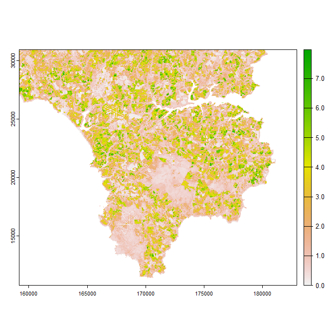\

In this instance the mosaiced data take care of cloud cover as at least one of the images are cloud free for all parts of the study area. In the inbuilt dataset`laifeb`, which contains February 2023 LAI data for part of the same region, this is not the case. Here the `lai_fill` function is used, together with land cover data to estimate likely lai values in cloud-obscured areas. 

```{r eval=FALSE}
lcoverc<-crop(lcover,lai_unfilled)
lai_filled<-lai_fill(lai_unfilled, lcoverc)
plot(lai_unfilled)
plot(lai_filled)
```
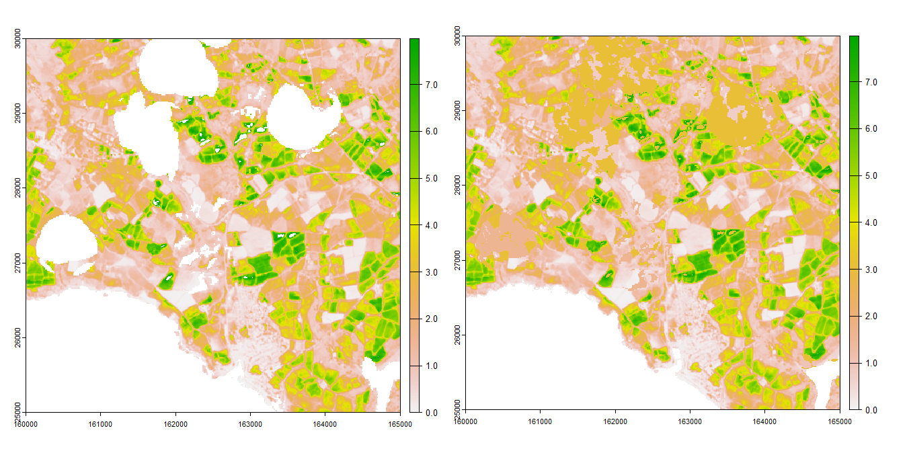\

As can be seen, the land cover data does a fairly sensible job of providing the information needed to cloud fill the image.

10m resolution LAI data are not available for most parts of the world at present. Consequently as an alternative 500m data can be downloaded and then down-scaled. Here demonstrate the work flow for doing that.

First lets download some 500m resolution LAI data for our study area. The download is much quicker

```{r eval=FALSE}
pathtopython<-"C:/Python/"
pathout<-"C:/Temp/Jan2/"
dir.create(pathout)
e <- ext(160000, 181400, 11300, 30000)
r <- rast(e)
crs(r) <- "EPSG:27700"
tme <- as.POSIXlt(c(0:30) * 3600 * 24, origin = "2023-01-01", tz = "UTC")  # Data for January 2023
lai_download(r, tme, reso = 500, pathout, credentials, pathtopython)
```

Again, we use the `lai_mosaic` function to mosaic the downloaded data

```{r eval=FALSE}
# Create sensible mask
lcover <- rast("C:/Temp/ESA_WorldCover_2023.tif")
lcover[lcover == 80] <- NA  # set permanent water bodies to NA'
lcover <- lcover * 0
lcover <- aggregate(lcover, 50, fun = 'mean', na.rm = TRUE)
# Perform mosaic
lai <- lai_mosaic(lcover, "C:/Temp/Jan2/", reso = 500, msk = TRUE)
plot(lai)
writeRaster(lai, "C:/Temp/lai_modis.tif")
```
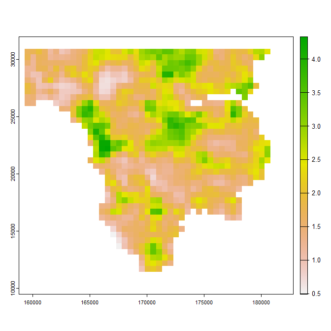\

Next, relying on the fact that different land cover types will typically have different leaf area index values and that there is an approximate allometric relationship between vegetation height and leaf area, we can use these datasets to downscale the LAI data. In effect, the land cover and vegetation height data are used to calculate expected LAI values at high resolution, which are then used to locally adjust the coarse-resolution LAI data.

```{r eval=FALSE}
lcover <- rast("C:/Landcover/Cornwall/Lizard/Landcover.tif")
veghgt <- rast("C:/Landcover/Cornwall/Lizard/veghgt.tif")
lai_fine <- lai_downscale(lai, lcover, veghgt, aszero = 80)  
plot(lai_fine)
```
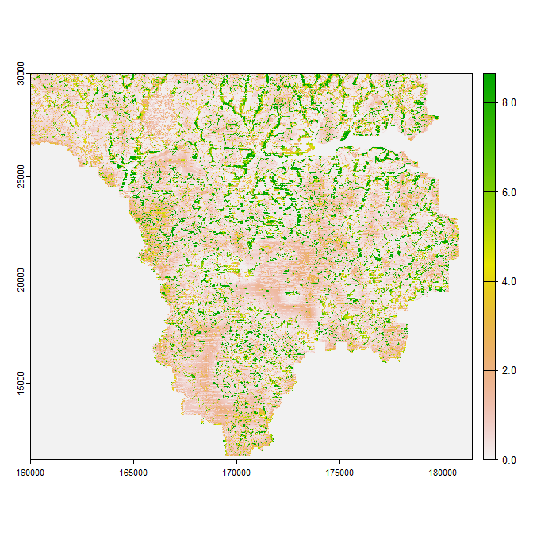\

The land cover and vegetation height data do a plausible job of downscaling the LAI data, although of course the dataset doesn’t exactly match the downloaded high-resolution equivalent. This is to be expected given that relationships between LAI and land cover and  vegetation height are only approximate. 

The final LAI data handling trick the package can perform is to seasonally adjust and cloud-infill LAI data at the same time using the function `lai_seasonadj`. This relies on the fact that there is a predictable phenological change in leaf area index values as the season progresses, but in general missing values at given location will be broadly similar to those either side. Here we demonstrate this using an inbuilt monthly dataset of LAI values fo a small part of our study area for entire year. Some of the monthly data are almost entirely comprised of NAs caused by cloud cover obscuring much of the study area over those months. Here we demonstrate this with the inbuilt dataset `monthlylai`.

```{r eval=FALSE}
plot(rast(monthlylai))
```
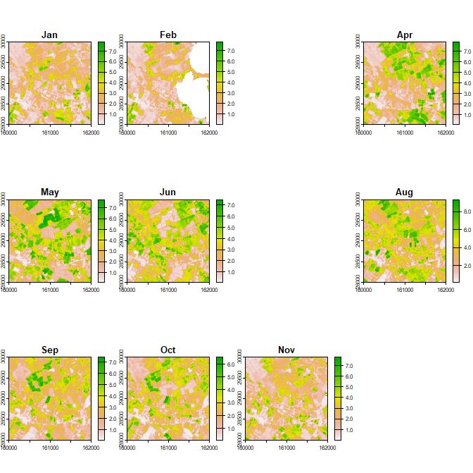\

As can be seen, this layer contains some cloud gaps in February, some months where all data are missing owing to the study area being completely cloud-obscured, and some months in which cloud data are complete

```{r eval=FALSE}
lai <- lai_seasonadj(rast(monthlylai))
plot(lai)
```
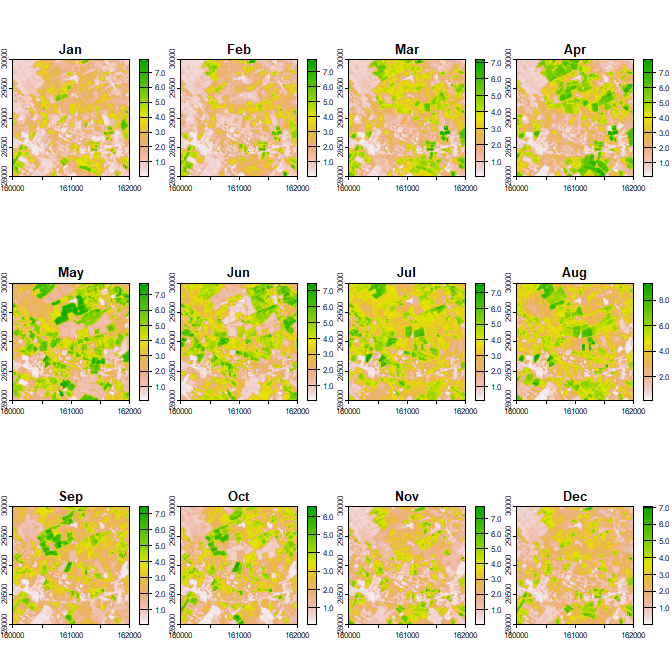\

As can be seen, missing data have been derived by interpolation. The greening-up of agricultural fields during the summer months is clearly evident.

One further option for downscaling Leaf area index data is available if the user has access to colour-infrared (CIR) and red-green-blue (RGB) areal imagery, which can be used to calculate the normalized-difference vegetation index (NDVI). This in turn derives leaf area index data by inverting a two-stream radiation model, making simple assumptions about typical leaf and ground reflectance in the red and near-infrared wavelengths. While there is no global repository of such data permitting download using API protocols, it is often easy enough to obtain such data for specific countries. In the UK, aerial photographs can be sourced from [Edina Digimap](https://digimap.edina.ac.uk/) or, for coastal some areas,  from the [Southeast Regional Coastal Monitoring Programme](https://coastalmonitoring.org/). In Spain, such data are available from [Plan Nacional de Observación del Territorio](https://www.ign.es/).

Because simplistic assumptions are made about ground and leaf reflectance and because most aerial photographs are brightness and contrast adjusted during processing, the derived NDVI values are not true NDVI. Thus MODIS-derived leaf-area index data  are used to rescale derived data, and the method should most appropriately thought of as a sharpening method. Below, use of the `lai_fromndvi` function is demonstrated. First, exemplar CIR and RGB data are downloaded form Zenodo. Note that when using the function to calculate NDVI, it is assumed that the first band in the `RGB` image corresponds to red and the first band in the `CIR` corresponds to near-infrared (NIR). This is how most (but not all) aerial photographs are ordered. However, since only the first bands of the `RGB` and `CIR` images are used for NDVI calculation, the  `RGB` and `CIR` supplied to the function can instead be single layer SpatRasters of red and near-infrared reflectance respectively.

```{r eval=FALSE}
# Download exemplar aerial imagery from Zenodo
url1 <- "https://zenodo.org/record/14476820/files/CIR_aerial.tif"
url2 <- "https://zenodo.org/records/14476820/files/RGB_aerial.tif"
dest_file1 <- "C:/Temp/CIR_aerial.tif"
dest_file2 <- "C:/Temp/RGB_aerial.tif"
download.file(url1, destfile = dest_file1, mode = "wb")
download.file(url2, destfile = dest_file2, mode = "wb")
# Read in downloaded files and previously saved MODIS data
CIR <- rast("C:/Temp/CIR_aerial.tif")
RGB <- rast("C:/Temp/RGB_aerial.tif")
ModisLAI <- rast("C:/Temp/lai_modis.tif")
# Run function and plot results
lai <- lai_fromndvi(RGB, CIR, ModisLAI)
plot(lai)
```
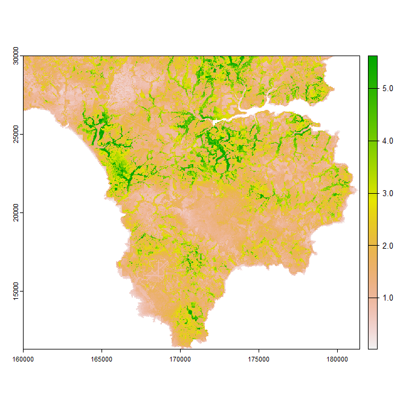\

## Soil and elevation data

### Digital elevation data
Digital elevation data are downloaded from the Amazon Web Server using function `dem_download`, which itself relies on the `elevatr` package. The data returned will match the resolution, extent and coordinate reference system of a SpatRaster template which is passed to the function. The resolution of available data varies globally however, so in some instances the returned data may be derived by interpolation. A map showing the resolution of available data is available from here:

https://github.com/tilezen/joerd/blob/master/docs/images/footprints-preview.png

For use with or use with microclimate packages, the returned SpatRaster, and hence supplied template raster should have a Mercator type Coordinate Reference System such that X, y and Z units are all in metres. Avoid using coordinate reference systems that define X and Y in terms of latitude and longitude. The data available unavoidably blend digital elevation and bathymetry data, the latter generally only available at coarser resolution. This can cause oddities in coastal regions. If downloading data for a coastal region it is sensible to use  the supplied template SpatRaster as a land-sea mask by setting the `msk` option to `TRUE`.

In the example below, we use our previously downloaded land cover data as a template and mask. The size of the downloaded dataset is quite large, so it will take a little while to download and reproject it. 

```{r eval=FALSE}
library(terra)
r <- rast("C:/Temp/ESA_WorldCover_2023.tif")
r[r == 80] <- NA # set permanent water bodies to NA
dtm <- dem_download(r, msk = TRUE)
plot(dtm)
```
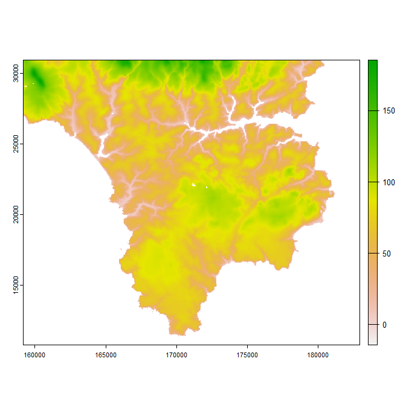\

### Soil data
Digital elevation data are downloaded from https://soilgrids.org/  using function `soildata_download`. The data returned will match the extent and coordinate reference system of a SpatRaster template which is passed to the function, but at this stage are retained at original grid resolution (~200m). The soilgrids database returns soil physical properties for the following depeth layers: 0-5cm, 5-15cm, 15-30cm, 30-60cm, 60-100cm and 100-200cm and he function downloads bulk density data (in cg/cm^3) and the mass  fraction of clay, sand and soilt in (g/kg). The function returns an inverse depth- & thickness weighted average of each variable for the entire soil profile, but if the function input `deletefiles` is set to false the original data for each layer are saved to the specified directory. Below is some example code demonstrating use of the function. Here we use the previously downloaded `dtm` as the raster template area. Note that the template provided must have an EPSG code defined as this is used in the download query.

```{r eval=FALSE}
library(httr)
soildata <- soildata_download(dtm, pathdir = "C:/Temp/", deletefiles = TRUE)
plot(soildata)
```
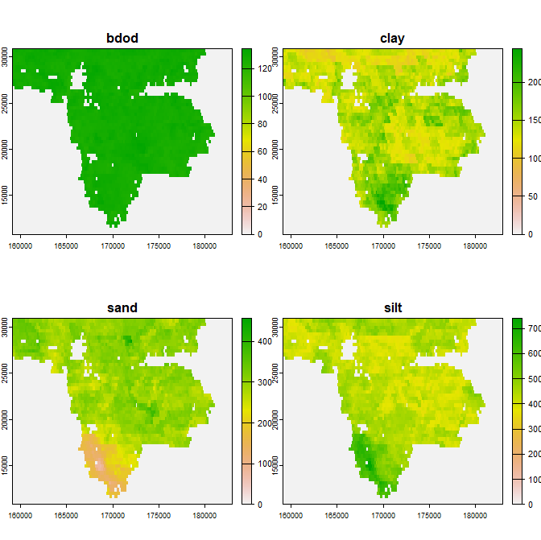\

As can be seen the data are quite coarse and contains missing data for several parts of the study area (values are returned as zero rather than NA). The function `soildata_downscale` can be used to downscale the data. Here, a the previously downloaded land cover dataset is used to 'sharpen' the data.


```{r eval=FALSE}
landcover <- rast("C:/Temp/ESA_WorldCover_2023.tif")
soildata <- soildata_downscale(soildata, landcover, water = 80)
plot(soildata)
```
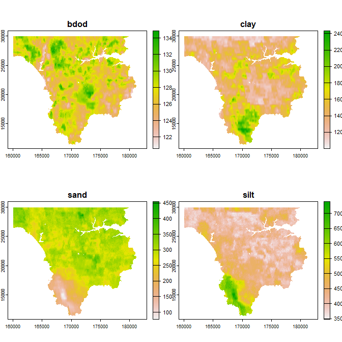\

The microclimate models take soil type as the input, which can be derived form these data as follows

```{r eval=FALSE}
soiltype <- soildata_gettype(soildata)
```

## Albedo data
At present, there are no high-resolution albedo products that can be downloaded automatically using API protocols. The best available source is MODIS data, which has a grid resolution of 500m. However, for many countries, high-resolution Red-Green-Blue (RGB) colour-infrared (CIR) aerial imagery are available form which relative measures of reflectance can be derived. These datasets are not generally automatically downloadable, but are easy enough to obtain. We therefore demonstrate a method of blending aerial photographs and MODIS data to generate high-resolution albedo data  (effectively using MODIS data to correct for brightness and contrast adjustments that are typically applied to aerial data). 

The model itself using ground and vegetation reflectance as inputs. I therefore also  demonstrate how albedo can be used to derive ground and vegetation reflectance. Before doing so, it is worth briefly explaining the distinction between albedo and reflectance.

The reflectance of a surface is an innate property of the material of surface that does not change as a function of the angle of the surface relative to the radiation source. Albedo differs from reflectance in a crucial way: it is not an innate property of a surface, but rather the actual fraction of light reflected from a surface, which varies as a function of the angle of incidence of that surface relative to the light surface. An equatorward-facing slope absorbed more solar radiation than a poleward facing-slope with equivalent reflectance, so will have a lower albedo. Albedo is also often referred to as either 'white-sky', 'black-sky' or 'blue-sky' albedo. 'Black-sky' albedo is the fraction of direct radiation reflected and 'white-sky' albedo the fraction of diffuse radiation reflected, assuming radiation to be spattered diffusely in an isotropic manner.  'white-sky' albedo therefore doesn't change as a function of solar altitude or azimuth, but 'black-sky' albedo does. Blue-sky albedo is the mixture of the two, weighted by the relative fraction of direct to diffuse radiation.  

Technically speaking, reflectance is also a wave-length specific property - the amount of light reflected depends on the wavelength of light, which is why different objects appear to the human eye or to have different colours. However, it is meaningful to have a single reflectance value for a surface, representing the broadband average reflectance across the shortwave spectrum. Likewise albedo is also an average measure across the shortwave spectrum. If averaging reflectances in different wavelengths it is important to note that the spectral density of radiation emitted by the sun differs by wavelength so that more energy is concentrated into certain wavelengths and is highest in the visible spectrum. When averaging reflectance in different wavelengths to derive a single broadband value, we need to weight reflectance in any given wavelength by the spectral density. A more detailed explanation of radiation is given [here](https://rpubs.com/ilyamaclean/1222802).


We start by downloading some MODIS-derived albedo data for January 2023. Here you will need the credentials dataset you created earlier (see instructions above). 

```{r eval=FALSE}
library(terra)
e <- ext(160000, 181400, 11300, 30000)
r <- rast(e)
crs(r) <- "EPSG:27700"
tme <- as.POSIXlt(c(0:743) * 3600, origin = "2023-01-01 00:00", tz = "UTC")
pathout <- "C:/Temp/albedo/"
albedo_download(r, tme, pathout, credentials)
```
 After a while, 89 `.hdf` files are downloaded into the directory specified by `pathout`. These represent all available MODIS data for the specified location and time period. We need to next need to mosaic these together and deal with cloud cover cover issues. This is all handled by the `albedo_process` function as follows:
 
```{r eval=FALSE}
 albmodis <- albedo_process(r, pathout)
 plot(albmodis, col = gray.colors(255), range = c(0, 1))
```
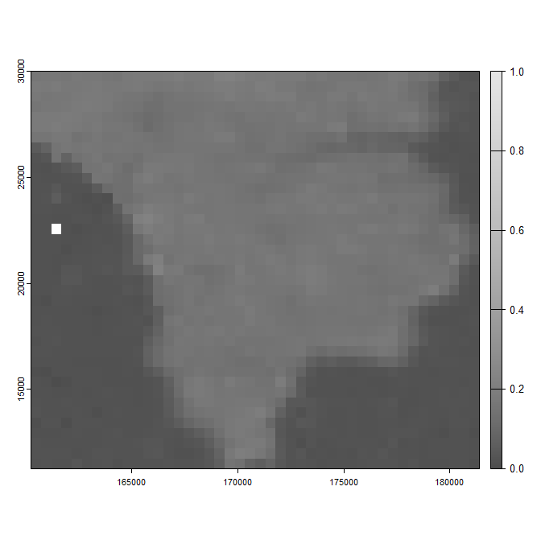\

The raster template `r` is provided to the function as the original downloaded data are complete MOIS tiles that cover a wider area than that specified originally in the download function. As can be seen, the data are quite coarse. We can deal with this issue by making use of the aerial photographs. If you haven't downloaded the example aerial photographs to do now using the method detailed at the end of the Leaf Area Index section. In the code below, we use these photos to derive a relative measure of albedo, that isn't exact albedo owing to the fact that brightness and contrast in the aerial photos has been adjusted. Note that the `albedo_fromaerial` function has the option to specify the exact wavelengths associated with each colour band in the aerial images. In the code below, the defaults are used. 

```{r eval=FALSE}
CIR <- rast("C:/Temp/CIR_aerial.tif")
RGB <- rast("C:/Temp/RGB_aerial.tif")
albphoto <- albedo_fromaerial(RGB, CIR)
plot(albphoto, col=gray.colors(255), range = c(0, 1))
```
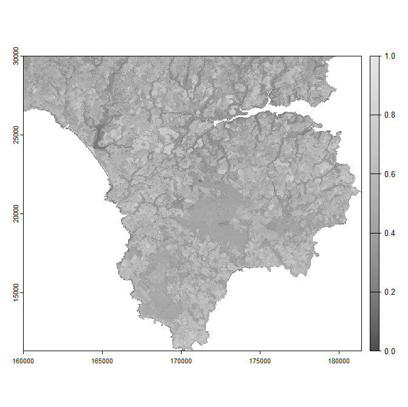\

The fine-scale patterns are picked out much more clearly now, but on average albedo is too high. This is fixed using the `albedo_adjust` function as follows:

```{r eval=FALSE}
albadjusted <- albedo_adjust(albphoto, albmodis)
plot(albadjusted, col=gray.colors(255), range = c(0, 1))
```
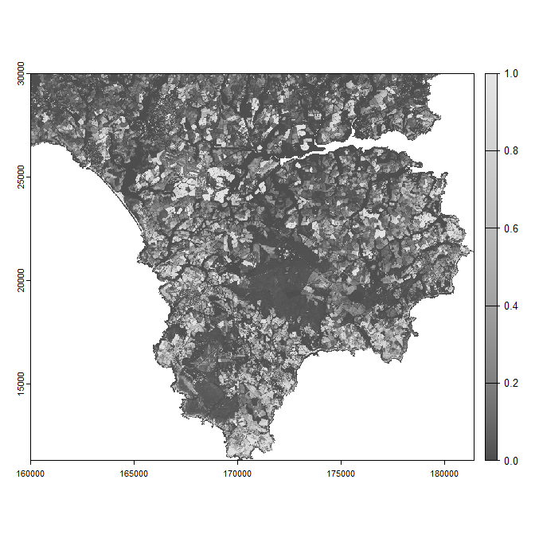\

## Climate data
Hourly climate data are required for running microclimate models, and must include estimates of temperature, humidity, pressure, short- and long-wave radiation, wind speed & direction and precipitation. The package contains tools for downloading and processing these data from a variaty of sources.

### NOAA-NCEP Data
This dataset, from the NOAA's NCEP-NCAR Reanalysis 1 project, comprises  estimates of all variables needed to run microclimate models, but
at six-hourly intervals and at a relatively coarse ~2 degree grid resolution. The function `ncep_download` is used to download the required data. the function `ncep_process` is used to convert climate variables to right variables and units and interpolate to hourly. The original data comprise a mixture of short-range forecasts and hindcasts and the processing accounts for this to provide estimates for the stated hour.

A description of the dataset is provided here:

https://psl.noaa.gov/data/gridded/data.ncep.reanalysis.html

No login credentials are needed. The download the data all one has to do is provide a template raster of the desired region and a POSIXlt object for the correct time-span. Given the large grid size of the original dataset, the returned data cover will typically cover a larger spatial extent than the SpatRaster template provided as an input. Data are downloaded in monthyl chunks and to accommodate the mixture of forecasts and hindcasts data one month other-side of provided time-sequence are downloaded. Here we create a template raster for the south-west of the UK and download data for May 2022, download the data and then save it to file for later use.

```{r eval=FALSE}
# create template raster
e <- ext(0, 300000, 0, 200000)
r <- rast(e)
crs(r) <- "EPSG:27700"
# create POSIXlt time sequence
tme <- as.POSIXlt(c(0:743)*3600, origin="2022-05-01 00:00", tz = "UTC")
# download and save data
ncepdata <- ncep_download(r, tme)
saveRDS(ncepdata, "C:/Temp/ncepdata.RDS")
attributes(ncepdata)
```

The data take a couple of minutes to download depending on the speed of your internet connection. The output is a list of two things: `tme` - a POSIXlt object of the longer time period corresponding to the data download. (2) `climdata` - a list of SpatRasters for each  of the climate variables

Once downloaded, processing it to provide hourly outputs ready for use with the microclimate model is pretty straightforward and doesn't take long:

```{r eval=FALSE}
ncephourly <- ncep_process(ncepdata, r, tme)
tc <- rast(ncephourly$temp)
mypal <- colorRampPalette(c("darkblue", "blue", "green", "yellow", 
                            "orange", "red"))(255)
plot(tc[[1]], col = mypal)
```
\

The output covers a larger extent that the input provided as by default a minimum of 2 x 2 grid cells of ncep data are downloaded. One can instead chose to resample the returned data to match the input template raster. Here we do this by downloading a one km grid resolution digital elevation dataset and using this as a template for resampling and to apply a land-sea mask. The processing takes a while longer given we are now returning 200 x 300 x 744 multi-layer SpatRasters of climate. 

```{r eval=FALSE}
res(r) <- 1000
dtm <- dem_download(r, msk = FALSE, zeroasna = TRUE)
ncephourly <- ncep_process(ncepdata, dtm, tme, resample = TRUE)
tc <- rast(ncephourly$temp)
mypal <- colorRampPalette(c("darkblue", "blue", "green", "yellow", 
                            "orange", "red"))(255)
plot(tc[[1]], col = mypal)
```
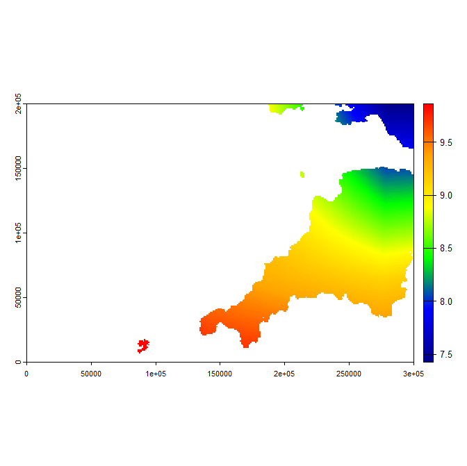\

Alternatively one can extract the data as a data,frame for the central location of the study area

```{r eval=FALSE}
ncephourly <- ncep_process(ncepdata , out = "point", r, tme)
head(ncephourly)
```

### ERA5 Data
The NOAA-NCEP data are pretty coarse, and although our mesoclim package provides the means to downscale these data, it does so in a manner predicted by terrain and landform and not in a way that explicitly accounts for synoptic weather patterns. E.g. this package would predict that higher altitude areas are generally cooler, cloudier and wetter, but it wouldn't pick-out a storm system tracking across the study area. For this reason it can be preferable to download high-resolution data. Currently, at a global level, the `microclimdata` package supports download of ERA5 data with a little help from the `mcera5` package. Data download from the Copernicus Climate Data Centre can be quite a slow business, so it is advisable to set data
downloads running e.g. over-night. In general there is less time-penalty imposed by widening the spatial extent than there is from extending the temporal time period, so if setting multiple downloads, chunk the data by time rather than spatially. 

In the example below, ERA5 data are downloaded to disk for the same area and time-period used when downloading NOAA-NCEP data. The data saves to the directory specified by `pathout` and the files are saved in monthly chunks using file names prefixed by `file_prefix`. The directory `pathout` is created if it doesn't exist provided the parent directory exists. If data downloads hang even after several hours, it is possible to re-run the function and it should pick-up where it left off. Note that before running the code, you will need to set up your credentials as specified above.

```{r eval=FALSE}
pathout <- "C:/Temp/ERA5_2022/"
file_prefix <- paste0(gsub("-","_",substr(Sys.time(),1,10)), "_")
req <- era5_download(r, tme, credentials, file_prefix, pathout)
```

Now go and get on with something else for a bit as the data will take quite a while to process. Once downloaded, you can process the data into the right format using the `era5_process` function. The format of the returned output is the same as when ncep_process is used. You can plot the results as before.

```{r eval=FALSE}
era5climdata <- era5_process(req, pathout, r, tme)
tc <- rast(era5climdata$temp)
mypal <- colorRampPalette(c("darkblue", "blue", "green", "yellow", 
                            "orange", "red"))(255)
plot(tc[[1]], col = mypal)
saveRDS(era5climdata, "C:/Temp/ERA5climdata.RDS")
```
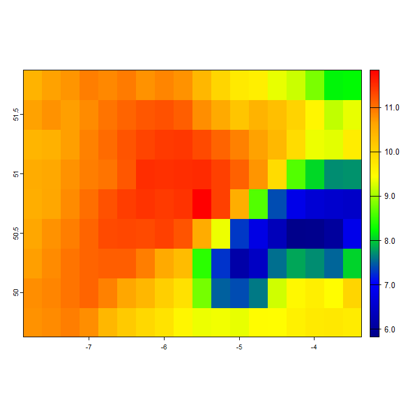\

The parameter `req` contains info on each of the files downloaded by `era5_download`. If more than one file is downloaded, `era5_process` stacks each file. If `req` is set to NA, all files in directory `pathin` are stacked. As with `ncep_process`, there is also the option to resample and mask the output by setting `resampleout` to `TRUE`. Likewise, there is also the option to return a dataframe by setting `out` to `point` instead of the default `grid`. 

### UK Met Office data
A final option for downloading historic climate data is to download daily temperature and precipitation data at a one km grid resolution for the UK.The dataset downloaded is the
HadUK-Grid data described [here](https://www.metoffice.gov.uk/research/climate/maps-and-data/data/haduk-grid/haduk-grid).
The `haduk_download` function downloads monthly datasets for the entire UK. The `haduk_process' function crops out the relevant area and time slices the data if not required for an entire month. Below we do so for May 2022, again cropping out the south-west of the UK.

```{r eval=FALSE}
# Download data
pathout <- "C:/Temp/HadUK_2022/"
datareturn <- haduk_download(tme, credentials, pathout)
# Check everything successfully downloaded
datareturned
# Process datasets
hadukdata <- haduk_process(r, tme, pathout)
tcmax <- rast(hadukdata$tasmax)
plot(tcmax[[1]], col = mypal)
```
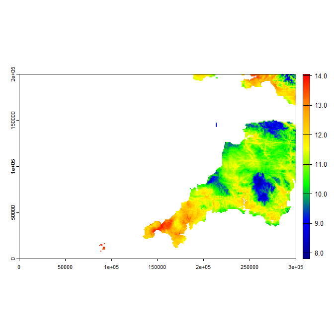\

The datasets take a minute or so to download depending on the speed of your internet connection. If one or more of the datasets fails to download, as sometimes happens, just run the function again. The function returns a list of wrapped SpatRasters of maximum (tasmax) and minimum (tasmin) daily temperature as well as daily precipitation. If users require hourly data and other climate variables, as would be needed if running `microclimf` for example, there is the option to blend e.g. ERA or NCEP data with HadUK-Grid data to return a full set of hourly climate variables at one km grid resolution. Daily temperatures and precipitation are converted to hourly by assuming that the hourly cycle in the coarse-resolution data are replicated at one km grid resolution.  Non temperature-dependent variables are just spatially interpolated. Temperature-dependent variables, namely downward longwave radiation and relative humidity account for the higher resolution temperature data.

```{r eval=FALSE}
onekmclim <- haduk_blend(era5climdata, hadukdata)
# plot temperature at 2pm on May 1st
tc <- rast(onekmclim$temp)
plot(tc[[15]], col = mypal)
# save dataset for later use if required
saveRDS(onekmclim,"C:/Temp/onekmclim.RDS")
```
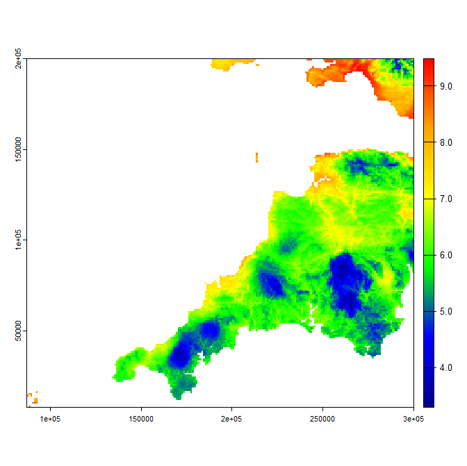\

The function takes a little while to run over large areas, but should get there after a minute or two. Those with a good knowledge of UK geography may notice that the returned `hadukdata` and as a result, the `onekmclim` datasets, are missing a few coastal grid cells. This is because such data are not available in the HadUK-Grid data provide by the Met office. This issue can be dealt with by using the function `haduk_coastfill`, but to make that function work, we require sea-surface temperature data. We thus show how the function can be used in the sea-surface tmeperature data section below.  

The `micropoint` package requires a data,frame of climate variables. We therefore provide an additional, potentially useful function for extracting a data.frame of climate data from any of the processed arrays. The function is quite asy to use. One just passes the processed list of climate SpatRasters to the function along with an `x` and `y` location. If `aslatlong` is set to `TRUE`, then x and y are assumed to be latitude and longitude in decimal degrees, whereas if `aslatlong` is set to `FALSE` x` and `y` are assumed to correspond to a grid reference location that uses the same coordinate reference system as the input climate data.  Here we extract
point data from the `onekmclim` dataset created previously:

```{r eval=FALSE}
climdf<-climpoint_extract(onekmdata, x = -5.2, y = 50.0, aslatlong = TRUE)
head(climdf,24)
```

There are three advantages to using this function. First, there is no option to return a data,frame from the `haduk_blend` or `haduk_coastfill` functions. Second, it enables more rapid extraction of point data for multiple locations. Lastly, by default the `out = "point"` options in the `era5_process` and `ncep_process` doesn't deal with the possibility that data for a point location near the edge of a coarse grid cell may take on values that are quite similar to
adjacent grid cells as opposed to the focal grid cell corresponding to `x` and `y`. By setting `resample` to `TRUE` in the climate processing functions, the raw climate data can be resampled to higher resolution and the extract performed on resampled data, thereby circumventing this edge issue. 

### UKCP18 Future Climate data
The UK Climate Projections 2018 (UKCP18) initiative provides up to 28 simulations of future daily weather (so called climate model members), which can be processed to obtain hourly weather of the type required to run microclimate models. Each simulation should be though of as possible run of weather conditions in the future. They are spatially coherent (i.e. if it is warm in one cell, it will likely be warm in the adjacent grid cell) and physically consistent across variables (i.e. if it is high pressure, likely also it will be low rainfall and sunny). 

Data are downloaded using the `ukcp18_download` download function. The raw downloaded data contain biases that should be corrected if comparing historic and future periods, with tools available for performing this bias correction in the `mesoclim` package. To help with this, one can also download historic modelled data, and it is by comparing these historic model runs to real observation data that bias corrections are performed. To access the data you will also need to generate a CEDA access token from [this page](https://services-beta.ceda.ac.uk/account/token/?_ga=2.221117848.1874942177.1727205775-405001952.1710779653) as specified in the instructions at the beginning of this vignette. As it expires periodically, you will need to refresh the token form time to time. The function downloads entire datasets rather than cropping out specific region, and data are available globally at 60 km grid resolution (`collection='land-gcm'`) or across Europe at 12 km grid resolution (`collection='land-rcm'`). Smaller tiles are also available for the UK (set `domain = 'uk'` rather than `domain = 'eur'` or `domain = 'global'`). Using `collection='land-gcm'` data are available for two Representative Concentration Pathways (rcp85 and 26) for `collection='land-rcm'` only data for rcp85 are available. 

The datasets for Europe and Global are huge (~2GB per climate variable) and take a while to download. If a dataset only partially downloads, just run the function again. It will check which datasets are already downloaded and skip those. In the code below, we download the 60 km datasets for the UK for climate model member '01', which doesn't take too long. Replace `cedatoken <- "mytoken"` with your actual token.

```{r eval=FALSE}
cedatoken <- "mytoken" # replace with actual token
tme <- as.POSIXlt(c(0:743)*3600, origin="2030-05-01 00:00", tz = "UTC") # Data for May 2030
output <- ukcp18_download(tme, cedatoken, pathout = "C:/Temp/UKCPData/",
                          collection ='land-rcm', 
                          domain = 'uk',
                          rcp = 'rcp85',
                          member = '01',
                          silent = FALSE)
```

The raw downloaded data are decadal data for the entire region. Once downloaded the data can be processed to crop out a particular region or time period using `ukcp18_process`. Not that, at this stage, the data are retained as daily and not converted to the variables required for running the `microgrid` or `micropoint` packages. This conversion also requires the data to be bias corrected and is completed using `ukcp18_biascorrect`

```{r eval=FALSE}
e <- ext(0, 300000, 0, 200000)
r <- rast(e)
crs(r) <- "EPSG:27700"
res(r) <- 1000
tme <- as.POSIXlt(c(0:743)*3600, origin="2030-05-01 00:00", tz = "UTC") # Data for May 2030
climvars <- ukcp18_process(r, tme, pathin = "C:/Temp/UKCPData/",
                          collection ='land-rcm', domain = 'uk',
                          rcp = 'rcp85',member = '01')
```

### Sea-surface temperature data
Daily 0.25 degree grid resolution sea-surface temperature data can be downloaded from the NOAA National Centers for Environmental Information using the function `download_sst`. The function returns a multi-layer SpatRaster of sea-surface temperature data matching the extent of the input template SpatRaster `r`, by default with coordinate reference system corresponding to EPSG 4326 (latitude-longitude outputs, WGS84). If required, the function can be resampled and reprojected and NA filled by setting the parameters `resampleout` and `nafill` to `TRUE`. 

```{r eval=FALSE}
# create template raster and POSIXlt object to pass to download_sst function
e <- ext(0, 300000, 0, 200000)
r <- rast(e)
crs(r) <- "EPSG:27700"
res(r) <- 1000
tme <- as.POSIXlt(c(0:743)*3600, origin="2022-05-01 00:00", tz = "UTC")
# not NA filled
sst1 <- sst_download(r, tme)
# NA filled
sst2 <- sst_download(r, tme, nafill = "TRUE")
# resampled / reprojected and NA filled
sst3 <- sst_download(r, tme, resampleout = "TRUE", nafill = "TRUE")
# plot SSDT on 1st May 2022
mypal <- colorRampPalette(c("darkblue", "blue", "green", "yellow", 
                            "orange", "red"))(255)
par(mfrow=c(2, 2))
plot(sst1[[1]], col = mypal)
plot(sst2[[1]], col = mypal)
plot(sst3[[1]], col = mypal)
```
\

Sea-surface temperature data are needed by the `mesoclim` package to calculate coastal effects. However, they are also used by the `haduk_coastfill` function to infill missing coastal grid cells. The function takes as an input outputs returned by the `haduk_blend` function. We illustrate its application below. The function takes a few minutes to run on large datasets.

```{r eval=FALSE}
# read in dataset returned by haduk_blend example
onekmclim <- readRDS("C:/Temp/onekmclim.RDS") 
newonekmclim <- haduk_coastfill(onekmclim, sst1) # sst1 = data downloaded above
# extract temperatures and crop to area around Isles of Scilly
eios<-c(75000, 100000, 0, 25000)
tc1 <- crop(rast(onekmclim$temp), eios)
tc2 <- crop(rast(newonekmclim$temp), eios)
# plot old and new 1km data for area around Isles fo Scilly
par(mfrow = c(1, 2))
plot(tc1[[15]], col = mypal)
plot(tc2[[15]], col = mypal)
```
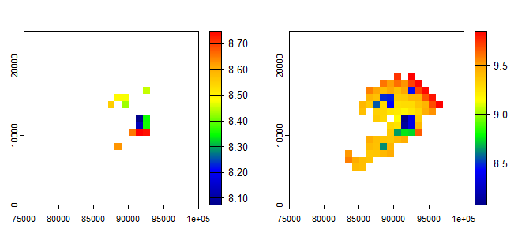\

The Isles of Scilly has many little offshore islets for which normally no data are provided (see [here](https://www.google.co.uk/maps/@49.9343481,-6.3494183,42412m/data=!3m1!1e3?entry=ttu&g_ep=EgoyMDI0MTAwMi4xIKXMDSoASAFQAw%3D%3D) for a full map). When `haduk_coastfill` is applied, data for any grid cell that contains at least some land are returned.  The function also contains an optional input parameter `wgt` with a default value of 0.5, which controls how heavily missing coastal cells are influenced by sea-surface temperatures. Setting this to zero means that the function simply searches the nearest 10 non-NA grid cells and takes on a value weighted by the inverse-distance squared to each of these cells. Setting `wgt` to one makes coastal grid cells much closer to sea-surface temperatures. For variables other than those that are temperature dependent, this inverse-distance squared method is used, though solar radiation values are also sensibly latitudinally adjusted.

## Deriving model inputs
### Deriving leaf and ground reflectance
The first step to deriving model inputs is to use these albedo data to derive ground and leaf reflectance. To do this, we also need to have an estimate of the leaf area index. Reflectances are calculated by applying using an inbuilt two-stream radiation model, which takes leaf area index, ground reflectance leaf and leaf area as inputs and returns albedo. A two-stream model, also requires an estimate of leaf inclinations as an input, which is handled by providing a raster of a parameter `x`, of the ratio of vertical to horizontal projections of leaf foliage. This can be estimated from land cover data using function `x_calc`. 

Because the two-stream model returns albedo, but here we are providing albedo, we need to invert the the model. This cannot be achieved mathematically so is instead achieved numerically, using a c++ equivalent of R's uniroot function. Because we are deriving both leaf reflectance and ground reflectance, there also needs to be a bit of additional iteration for the algoirthm to converge on a stable solution. Consequently the function is a little slow on large datasets. The example below takes a few minutes. For context, it is numerically finding a solution by carrying out up to 5000 iterations on each of the >2 million individual pixels, equating to billions of individual calculations. So despite the short wait, it is actually a pretty computationally efficient function, with high performance achieved by running  c++ under the hood.

In the example below, because we use aerial photographs to derive albedo, we also use the lai dataset derived from these photos. When applying `reflectance_calc`, we set `plotprogress = TRUE`, meaning it will periodically plot interim results as the model iterates to find a solution. We assume some of the previous datasets have already been downloaded and saved. If this is not the case, run the example code provided in the relevent sections above.

```{r eval=FALSE}
library(terra)
# Read in previously downloaded RGB and CIR images
CIR <- rast("C:/Temp/CIR_aerial.tif")
RGB <- rast("C:/Temp/RGB_aerial.tif")
# Process previously downloaded MODIS albedo data. 
albmodis <- albedo_process(CIR[[1]], "C:/Temp/albedo/")
# Derive and adjust albedo form aerial photographs
albphoto <- albedo_fromaerial(RGB, CIR)
albedo <- albedo_adjust(albphoto, albmodis)
# Read in previously downloaded modis-derived LAI data and sharpen using photos
modislai <- rast("C:/Temp/lai_modis.tif")
lai <- lai_fromndvi(RGB, CIR, modislai)
# Derive leaf inclination angle coefficient and tidy it
landcover <- rast("C:/Temp/ESA_WorldCover_2023.tif")
landcover <- crop(landcover, ext(lai))
x <- x_calc(landcover, lctype = "ESA")
x <- mask(x, lai)
# Derive leaf and ground reflectance
refldata <- reflectance_calc(albedo, lai, x, plotprogress = TRUE)
# Plot outputs
par(mfrow = c(1, 2))
plot(refldata$gref, col=gray.colors(255), range = c(0, 1), main = "Ground")
plot(refldata$lref, col=gray.colors(255), range = c(0, 1), main = "Leaf")
```
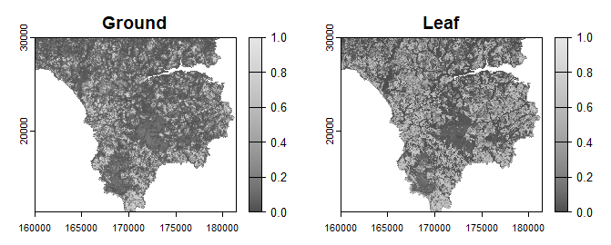\

### Vegetation parameters
To derive the vegetation parameter inputs to the grid model, it is a simple case of using the function `create_veggrid` function. A few of the parameters are derived from landcover data, and it is thus necessary to specify whether the landcover dataset is derived from ESA or CORINE. Alternatively, if using a bespoke landcover dataset, you will need to create your own lookup data.frame for the function input `lctype`. The format of this data,frame should follow the inbuilt datasets `corinetable` or `esatable` with the values in the `Code` column changed to match the values in `landcover`. In the example below, we leave `lctype` as it's default ESA, is this is thre landcover dataset we are using. We assume vegetation height data have already been downloaded.

```{r eval=FALSE}
library(terra)
# read in vegetation height data
vhgt <- rast("C:/Temp/canopy_height_2020.tif")
vhgt <- crop(vhgt, ext(lai))
vegp <- create_veggrid(landcover, vhgt, lai, refldata, lctype = "ESA")
class(vegp)
attributes(vegp)
```

The resulting dataset is an object of class `vegparams` ready for using with the microclimate grid models (`microclimf` or `microgrid`). It comprises a list of the following PackedSpatRasters:

(1) pai - plant area index (here assumed same as leaf area index)
(2) hgt - vegetation height ($\small m$)
(3) x - leaf inclination coefficient: ratio of vertical to horizontal projections of leaf foliage. 
(4) gsmax - maximum stomatal conductances ($\small mol/m^2/s$)
(5) leafr - leaf reflectance (of shortwave radiation)
(6) clump - canopy clumping coefficient
(7) leafd - leaf diameter ($\small m$)
(8) leaft - leaf transmittance (of shortwave radiation)

To derive the vegetation parameter inputs to the point model, it is a simple case of using the function `create_vegpoint` function.  If a latitude and longitude or not supplied, data are extracted for the location at the centre of the supplied `landcover` raster. Below we demonstrate the use of this function supplying the previously dowenloaded vegetation inputs. However, normally one would supply much smaller gridded inputs to avoid the computational penalty of downloading and processing them, 

```{r eval=FALSE}
# Create and show point model vegetation parameter input
vegp_point <- create_vegpoint(landcover, vhgt, lai, refldata, lctype = "ESA", lat = 50.02, long = -5.19)
vegp_point
```

The resulting dataset is a list of vegetation parameters ready for using with the 'micropoint'. It comprises the following elements:

(1) h - vegetation height ($\small m$)
(1) pai - plant area index (here assumed same as leaf area index)
(3) x - leaf inclination coefficient: ratio of vertical to horizontal projections of leaf foliage.
(4) clump - canopy clumping coefficient
(5) lref - leaf reflectance (of shortwave radiation)
(6) ltra - leaf transmittance (of shortwave radiation)
(7) leafd - leaf diameter ($\small m$)
(8) gsmax - maximum stomatal conductances ($\small mol/m^2/s$)
(9) q50 - value of PAR when stomatal conductances is at 50 percent of its maximum value ($\small \mu mol/m^2/s$)

### Soil parameters
To derive the soil parameter inputs to the grid model, the `create_soilgrid` function is used. The `soildata` supplied to the function are the raw downloaded data prior to downscaling, as the function itself does the downscaling.  Hence land cover data must also be supplied, along with soil reflectance data derived using `reflectance_calc`. In the example below, we download soil data, but use the previously downloaded land cover dataset, along with reflectance data we derived earlier.

```{r eval=FALSE}
library(terra)
library(httr)
library(terra)
r <- rast("C:/Temp/CIR_aerial.tif")[[1]]
soildata <- soildata_download(r, pathdir = "C:/Temp/", deletefiles = TRUE)
soilc <-  create_soilgrid(soildata, refldata, landcover, water = 80)
attributes(soilc)
```

The resulting dataset is an object of class `soilcharac` ready for using with the microclimate grid models (`microclimf` or `microgrid`). It comprises a list of the following PackedSpatRasters:

(1) soiltype - a PackedSpatRaster of soil types specified using integer values (see below)
(2) groundr - a PackedSpatRaster object of ground reflectances
(3) rho - a PackedSpatRaster object of bulk densities ($\small Mg/m^3$)
(4) Vm - a PackedSpatRaster object of the estimated volumetric mineral fraction of soil ($\small m^3/m^3$)
(5) Vq - a PackedSpatRaster object of the volumetric quartz fraction of soil ($\small m^3/m^3$)
(6) Mc - a PackedSpatRaster object of the mass fraction of clay ($\small kg/kg$

In `soiltype`, the integer values of correspond to the following soil types:

(1) - Sand
(2) - Loamy sand
(3) - sandy loam
(4) - Loam
(5) - Silt loam
(6) - Sandy clay loam
(7) - Clay loam
(8) - Silty clay loam
(9) - Sandy clay
(10) - Silty clay
(11) - Clay

To derive the soil parameter inputs to the point model, it is a simple case of using the function `create_soilpoint` function.  If a latitude and longitude or not supplied, data are extracted for the location at the centre of the supplied `landcover` raster. Below we demonstrate the use of this function supplying the previously downloaded soil inputs. Additionally, to derive slope and aspect, we need to derive a digital elevation dataset. Unlike with vegetation parameters it is advisable to provided fairly extensive gridded inputs so that the downscaling can be performed sensibly.  

```{r eval=FALSE}
# Download digital elevation dataset
dtm <- dem_download(r)
# Create point model parameter list
groundp <- create_soilpoint(soildata, refldata, dtm, landcover, lat = 50.02, long = -5.19, water = 80)
groundp
```

The resulting dataset is an object of class `groundparams` ready for using with `micropoint`. It comprises a list of the following:

(1) gref - ground reflectance
(2) slope - slope of ground surface ($\small \circ$ from horizontal)
(3) aspect - aspect of ground surface ($\small \circ$ from north)
(4) em - emissivity of ground surface
(5) rho - Soil bulk density ($\small Mg/m^3$)
(6) Vm - Volumetric mineral fraction of soil ($\small m^3/m^3$)
(7) Vq - Volumetric quartz fraction of soil ($\small m^3/m^3$)
(8) Mc - Mass fraction of clay ($\small kg/kg$)
(9) b - Shape parameter for Campbell soil moisture model
(10) Psie - Matric potential ($\small J/m^3$)
(11) Smax - Volumetric water content at saturation ($\small m^3/m^3$)
(12) Smin - Volumetric residual water content ($\small m^3/m^3$)
(13) alpha - Shape parameter of the van Genuchten model ($\small cm^{-1}$)
(14) n - Pore size distribution parameter
(15) Ksat - Saturated hydraulic conductivity ($\small cm/day$)

### Climate inputs
