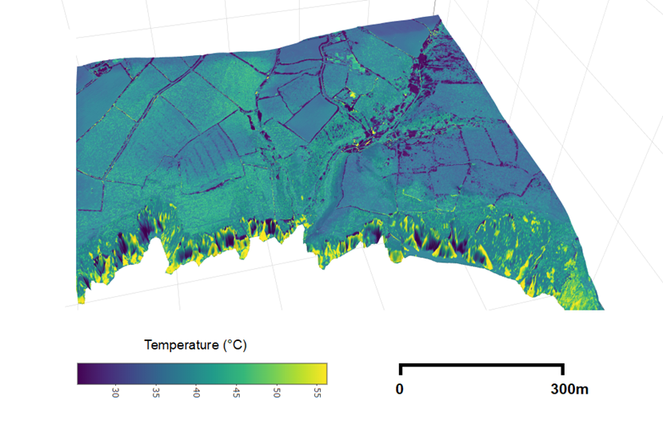
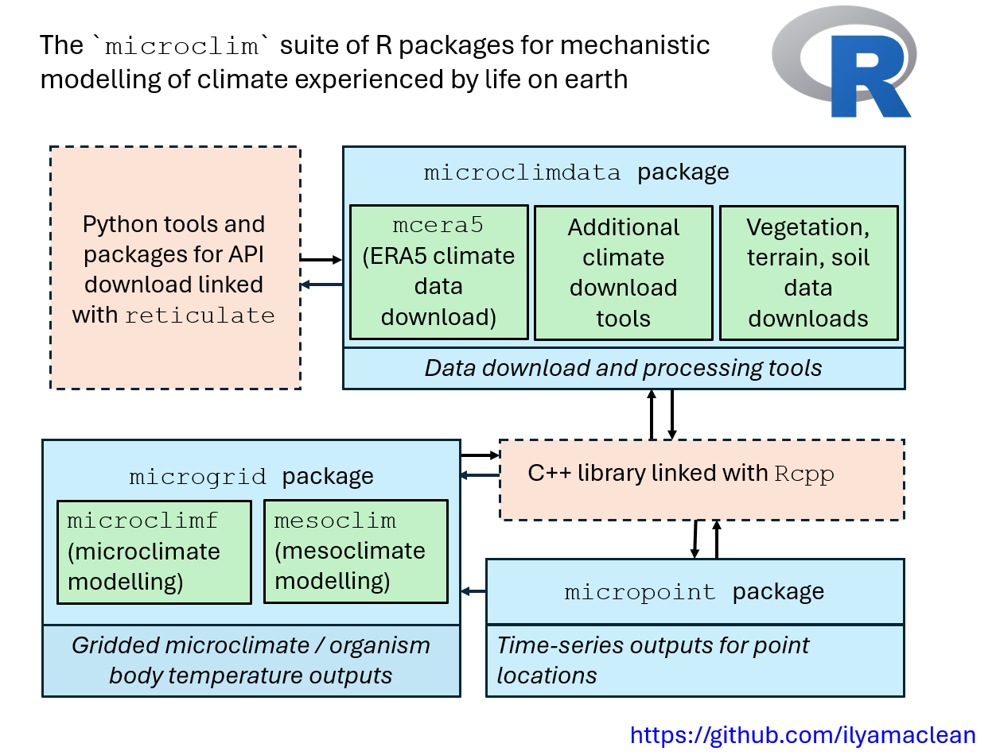

```{r, include = FALSE}
knitr::opts_chunk$set(
  collapse = TRUE,
  comment = "#>"
)
```
<style>
  body {
    text-align: justify;
  }
  
  .col2 {
    columns: 2 200px;         /* number of columns and width in pixels */
    -webkit-columns: 2 200px; /* chrome, safari */
    -moz-columns: 2 200px;    /* firefox */
  }
  
  .leg {
    font-size: 12px;
  }

  img {
    display: block;
    margin-left: auto;
    margin-right: auto;
    max-width: 100%;
    height: auto;
  }

  .figure {
    text-align: center;
    margin: 20px 0;
  }

  .figure img {
    display: inline-block;
    vertical-align: middle;
  }

  .figure figcaption {
    font-size: 12px;
    text-align: center;
  }
</style>

# Overview
This site describes the microclim suite of packages for the R programming environment that compute meso- and microclimate in real landscapes. The models are intended to help ecologist understand the local climatic conditions experienced by life on earth. Microclimatic conditions often differ substantially from macroclimate - the climate typically measured by weather stations and available as gridded datasets globally. Microclimates are chiefly mediated by the interaction between weather conditions and features of the landscape, namely topography, vegetation and soil and often vary at fine spatial and temporal resolution. Microclimates directly influence the ecophysiology of organisms, and thus influences the fitness of individuals, the dynamics of populations, the composition of communities and the function of ecosystems.

\
<small><i><b>Example output produced by microclimate models:</b> microclimate modelled at one meter grid resolution across Caerthilliean Cove, Lizard Peninsula, Cornwall, United Kingdom</i></small>.

# Contents
* [Microclimate packages](#microclimate-packages)
  + [Data aquisition](#data-aquisition)
    - [mcera5](#mcera5)
    - [microclimdata](#microclimdata)
  + [Point location modelling](#point-location-modelling)
    - [micropoint](#micropoint)
  + [Gridded outputs](#gridded-outputs)
    - [microgrid](#microgrid)
    - [mesoclim](#mesoclim)
    - [microclimf](#microclimf)
  + [Legacy packages](#legacy-packages) 
  + [Packages by other authors](#packages-by-other-authors) 
* [Underlying theory](#underlying-theory)
  + [Mesoclimate modelling](#mesoclimate modelling)
  + [Point microclimate modelling](#point-microclimate-modelling)
  + [Grid microclimate modelling](#grid-microclimate-modelling)
* [Applications](#applications) 
  + [Historic climate](#historic-climate)
  + [Future climate](#future-climate)
* [Testing](#testing) 
  + [Sensor development](#sensor-development)
  + [SoilTemp and the MEB Network](#soiltemp-and-the-MEB-Network)
  + [Model validation](#model-validation)
* [Published papers](#published-papers) 
  + [Review papers](#review-papers)
  + [Modelling papers](#modelling-papers)
  + [Application papers](#application-papers)
    

# Microclimate packages
Blah blah
\

## Data aquisition
